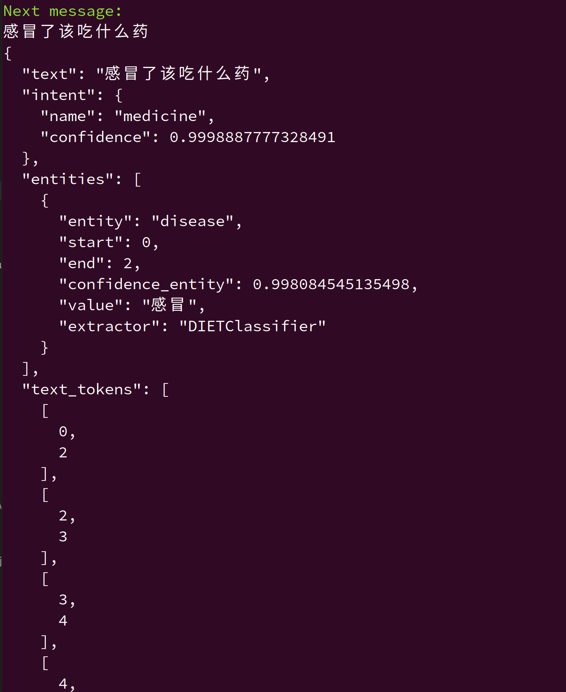

# Rasa 小demo

## Rasa 版本和项目依赖

本书所用代码均在 Rasa 3.0.X 版本中完成。
读者可以使用：

```shell
pip install rasa==3.5.0 rasa-sdk==3.5.0 -i https://pypi.tuna.tsinghua.edu.cn/simple
```

完成项目代码的依赖安装。

## 训练 Rasa NLU 模型

```shell
rasa train --data /data
```

## 运行服务  

**（1）启动Rasa服务**

&emsp;在命令终端，输入下面命令：

```shell
# 启动rasa服务
# 该服务实现自然语言理解(NLU)和对话管理(Core)功能
# 注：该服务的--port默认为5005，如果使用默认则可以省略
python3 -m rasa run --port 5005 -m models/训练model文件 --endpoints endpoints.yml --credentials credentials.yml --debug

```

**（2）启动Action服务**

在命令终端，输入下面命令：

```shell
# 启动action服务
# 注：该服务的--port默认为5055，如果使用默认则可以省略
python3 -m rasa run actions --port 5055 --actions actions --debug 
```

**（3）测试**
```shell
python3 demo.py
```

## 控制台命令启动和测试

```shell
rasa shell nlu
```

尝试输入一些查询，例如“如果我感冒了，我应该吃什么药”并查看回复。

演示效果如下所示：



## rasa配置文件 

>1.nlu.yml：自然语言理解（NLU）文件，用于定义意图、实体、训练数据以及NLU模型的配置。这个文件包括了你的对话助手应该理解的用户输入的训练数据。

>2.stories.yml：对话故事文件，用于定义对话的不同路径，包括用户的意图、实体和助手的响应。这有助于训练和评估对话管理模型。

>3.rules.yml：对话规则文件，用于定义明确的对话规则，以引导对话流程。规则可以基于用户的意图和其他条件来触发动作。

>4.config.yml：模型配置文件，用于定义NLU和对话管理模型的架构和参数配置。这包括选择使用的NLU和对话策略，以及它们的配置。

>5.credentials.yml：凭据文件，用于存储连接到外部服务的认证信息，例如聊天渠道的令牌、API密钥等。

>6.domain.yml：领域文件，用于定义对话中可用的意图、实体、槽位、响应和动作。它描述了对话的上下文和领域。

>7.endpoints.yml：端点文件，用于配置外部服务端点，例如自定义动作服务器、模型存储位置等。